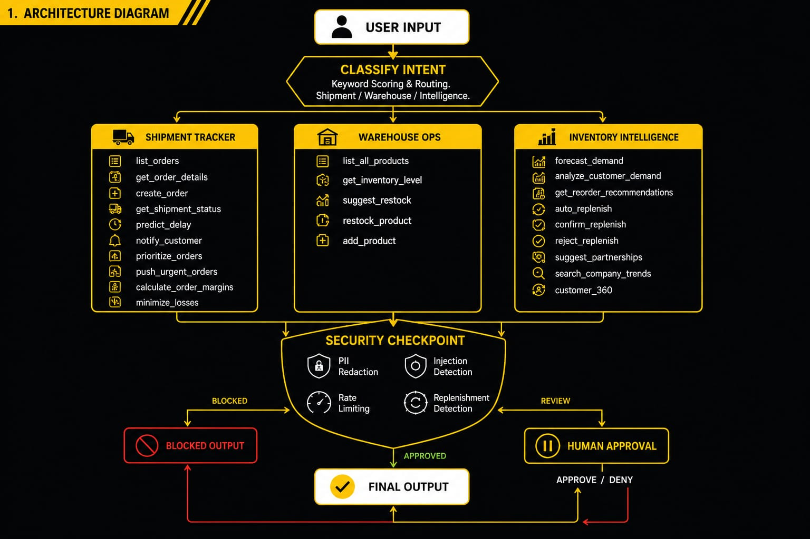
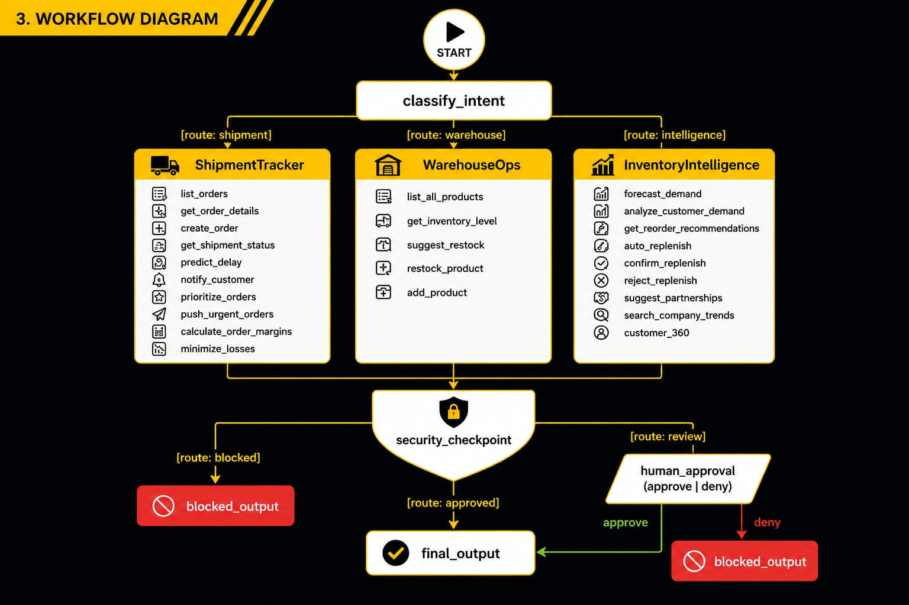
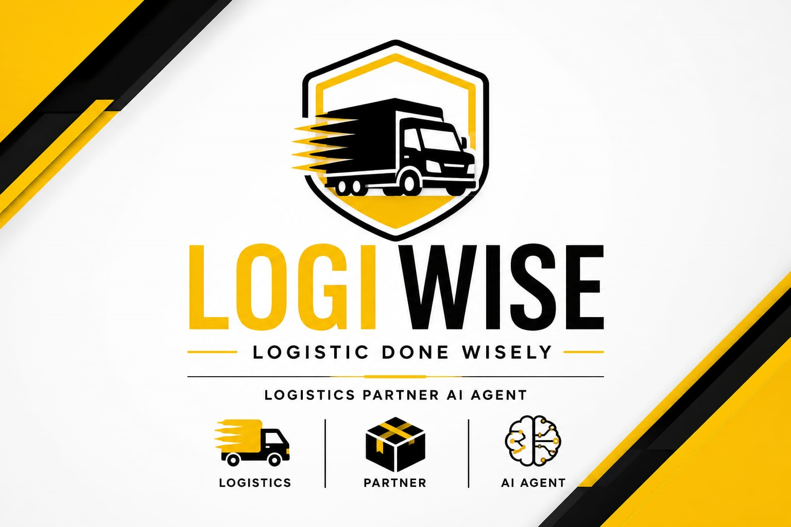

# LogiWise — Logistics AI Agent

An intelligent logistics agent built with Google ADK (Agent Development Kit) that combines shipment tracking, warehouse operations, order management, inventory control, demand forecasting, and profit analysis into a single conversational multi-agent workflow.

## Features

- **Track Shipments** — Look up real-time status, location, carrier, and ETA by tracking number
- **Predict Delays** — Get delay predictions based on location and current conditions
- **Manage Orders** — List all orders, get order details, create new orders with auto-resolved SKUs
- **Manage Inventory** — Check stock levels, view low-stock alerts, restock products, add new products with auto-generated SKUs
- **Forecast Demand** — Daily demand projections with safety stock and reorder point calculations using weighted moving average + seasonal multipliers
- **Auto-Replenishment** — Propose replenishment orders that require human approval before execution
- **Customer 360** — Unified customer profile with orders, P&L, partnership score, and predictions
- **Order Margins** — Detailed P&L breakdown: revenue, COGS, shipping, handling, storage, net profit
- **Loss Minimization** — Actionable recommendations to reduce costs and improve margins
- **Order Prioritization** — Rank orders by urgency (CRITICAL/URGENT/PRIORITY/STANDARD)
- **Partnership Suggestions** — Data-driven partner recommendations based on growth, frequency, and diversity
- **Notify Customers** — Send email/SMS notifications about shipment status changes
- **Security** — PII redaction, injection detection, rate limiting, and human-in-the-loop approval

## Architecture

```
LogiWise (Workflow)
├── classify_intent         — Routes requests to ShipmentTracker, WarehouseOps, or InventoryIntelligence
├── ShipmentTracker         — Orders, shipments, tracking, notifications, margins, prioritization
├── WarehouseOps            — Inventory, restock, add products
├── InventoryIntelligence   — Forecasting, replenishment, customer 360, partnerships, trends
├── security_checkpoint     — PII redaction, injection detection, rate limiting, replenishment detection
├── human_approval          — Human-in-the-loop for replenishment proposals
├── final_output            — Formatted response to user
└── blocked_output          — Security-blocked response
```

### Agent Tools

| Tool | Description |
|------|-------------|
| `list_orders` | List all orders, optionally filtered by customer |
| `get_order_details` | Get full details for a specific order |
| `create_order` | Create a new order — auto-resolves SKUs from product names, auto-creates missing products/customers |
| `get_shipment_status` | Look up current status and location by tracking number |
| `predict_delay` | Predict shipment delays based on location |
| `notify_customer` | Send email/SMS notification to a customer |
| `prioritize_orders` | Rank all orders by urgency (CRITICAL/URGENT/PRIORITY/STANDARD) |
| `push_urgent_orders` | Flag CRITICAL/URGENT orders with SLA-based action plan |
| `calculate_order_margins` | Full P&L breakdown for an order |
| `minimize_losses` | Cost-saving recommendations for unprofitable orders |
| `list_all_products` | View all products with SKUs and stock levels |
| `get_inventory_level` | Check inventory quantity for a SKU |
| `suggest_restock` | Get recommended restock quantity based on sales velocity |
| `restock_product` | Add stock to an existing product (accepts name or SKU) |
| `add_product` | Add a new product with auto-generated SKU |
| `forecast_demand` | Daily demand, safety stock, reorder point projections |
| `analyze_customer_demand` | Buying patterns, growth trends, category analysis per customer |
| `get_reorder_recommendations` | Scans all products — flags what needs restocking with suggested quantities |
| `auto_replenish` | Propose replenishment order (requires human approval) |
| `confirm_replenish` | Execute a previously proposed replenishment |
| `reject_replenish` | Cancel a pending replenishment proposal |
| `suggest_partnerships` | Ranked partnership recommendations by growth-weighted algorithm |
| `search_company_trends` | Market insights across customer database |
| `customer_360` | Unified profile: orders, P&L, partnership score, predictions |

## Getting Started

### Prerequisites

- Python 3.11+
- [uv](https://docs.astral.sh/uv/getting-started/installation/) — Python package manager
- An LLM API key (see backends below)

### Quick Setup

```bash
# 1. Clone and install
git clone <repo-url> logiwise
cd logiwise
uv sync

# 2. Configure .env with your API key
#    Copy from .env.example and set MODEL_BACKEND + API key

# 3. Run the server
make run     # Start server at http://localhost:18081
```

### Supported Backends

Set `MODEL_BACKEND` in `.env`:

| Backend | Env Var | API Key |
|---------|---------|---------|
| **NVIDIA** (recommended) | `MODEL_BACKEND=nvidia` | `NVIDIA_API_KEY` — get at https://build.nvidia.com |
| **OpenRouter** | `MODEL_BACKEND=openrouter` | `OPENROUTER_API_KEY` — get at https://openrouter.ai |
| **Gemini** | `MODEL_BACKEND=gemini` | `GOOGLE_API_KEY` — get at https://aistudio.google.com |

### Quick Test

```bash
# Using the CLI
uv run adk run app "List all products"
uv run adk run app "Forecast demand for SKU-ELEC-004"
uv run adk run app "Show customer 360 for CUST003"
```

## Sample Conversations

**Track a shipment:**
> User: `Where is my shipment TRK10001?`
> Agent: TRK10001 — IN_TRANSIT at Memphis Hub, ETA 2026-06-30 via FedEx

**Check and restock inventory:**
> User: `Check stock for Cotton Fabric`
> Agent: SKU-FAB-001 — Cotton Fabric Roll 50m, qty: 200, threshold: 50, needs restock: No
> User: `Restock by 50`
> Agent: Restocked: 200 → 250 (+50)

**Forecast demand:**
> User: `Forecast demand for SKU-ELEC-004`
> Agent: Bluetooth Speaker — Forecasted Daily Demand: 4.2 units/day, Safety Stock: 10, Reorder Point: 69

**Create a new order:**
> User: `Create an order for Walkarounds Inc with USB-C Hub:50`
> Agent: Order ORD-3010 created. Items: USB-C Hub x50. Status: PENDING

**Auto-replenish:**
> User: `Auto-replenish low stock Bluetooth Speakers`
> Agent: [REPLENISHMENT_PROPOSAL] ... Status: PENDING HUMAN APPROVAL
> User: `approve`
> Agent: Replenishment approved and executed: Bluetooth Speaker (SKU-ELEC-004): +60 units

## Project Structure

```
logiwise/
├── app/
│   ├── __init__.py           # App exports
│   ├── agent.py              # Main agent — Workflow, 3 sub-agents, security nodes
│   ├── tools.py              # All tools (orders, shipments, inventory, forecasting, margins)
│   ├── forecasting.py        # Demand forecasting engine (moving avg, seasonal, safety stock)
│   ├── config.py             # Multi-backend config (NVIDIA/OpenRouter/Gemini)
│   ├── mcp_server.py         # MCP server (deprecated — tools are direct)
│   └── agent_runtime_app.py  # Agent Runtime entry point
├── tests/
│   ├── unit/
│   └── integration/
├── .env                      # API keys and model selection
├── .env.example              # Template for new users
├── pyproject.toml            # Dependencies
├── Makefile                  # Install/run/test targets
├── FEATURES.md               # Full feature reference with test queries
├── DEMO.md                   # Demo script
├── README.md                 # This file
└── submission_writeup.md     # Competition submission write-up
```

## Development

```bash
make install   # uv sync
make run       # Start server at http://localhost:18081
make test      # Run pytest
```

## Assets


*LogiWise architecture — user input flows through classify_intent, branches to 3 sub-agents (ShipmentTracker, WarehouseOps, InventoryIntelligence), passes through security checkpoint, and routes to human approval or final output.*


*Workflow graph — directed edges with route labels connecting START, classify_intent, sub-agents, security_checkpoint, human_approval, final_output, and blocked_output.*


*Project thumbnail — "LogiWise — Logistics AI Agent" with globe wireframe, logistics routes, and warehouse/truck icons on royal dark blue background.*

## License

MIT
